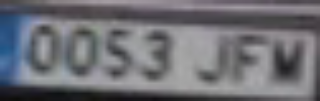

# Visión por Computador - Práctica 3

## Entrenamiento

Esta práctica ha consistido en realizar un prototipo, que procese vídeo para la detección y seguimiento de vehículos y personas, además deberá aplicar reconocimiento de caracteres sobre las matrículas visibles.

Para ello se ha utilizado como base el dataset de este [enlace](https://datasetninja.com/traffic-vehicles-object-detection), que incluye la mayoría de las clases requeridas, faltando las personas. Las anotaciones se encuentran en el formato de entrenamiento de YOLO, para modificarlas las convertimos al formato json de *labelme* y automatizamos la mayor parte de la anotación de las personas utilizando la detección del modelo *yolo11n.pt*, revisando el resultado con la herramienta *labelme*. El código utilizado para esto está en [generardataset.ipynb](generardataset.ipynb).


Una vez procesado, convertimos las anotaciones al formato y estructura de carpetas de YOLO utilizando la herramienta *C:\Users\Usuario\VC_RES\VC_P4*.

```Anaconda Prompt
pip install labelme2yolo
labelme2yolo --json_dir res --val_size 0.16 --test_size 0.2
```

Utilizamos el dataset resultante para entrenar durante 80 ciclos

```Anaconda Prompt
yolo detect train model=yolo11n.pt data=dataset.yml imgsz=640 batch=4 device=0 epochs=80
```

## Procesamiento

El resultado del entrenamiento se ha utilizado para procesar el video [C0142.MP4](C0142.MP4). La detección del texto en las matrículas se ha realizado empleando *pytesseract*, pre-procesando las imágenes mediante un umbralizado para eliminar ruido y facilitar la extracción del texto y descartando caracteres no alfanuméricos del resultado. Pese a estos esfuerzos los resultados obtenidos no son muy buenos y aunque en ocasiones se aproxima al texto de la matrícula, con más frecuencia difiere completamente.




El resultado del procesamiento genera un video con las siguientes características:
- detecta y sigue las personas y vehículos presentes
- detecta y lee las matrículas de los vehículos presentes
- cuenta el total de cada clase


Adicionalmente, genera un archivo csv con los siguientes campos:

```CSV
fotograma, tipo_objeto, confianza, identificador_tracking, x1, y1, x2, y2, matrícula_en_su_caso, confianza, mx1,my1,mx2,my2, texto_matricula
```